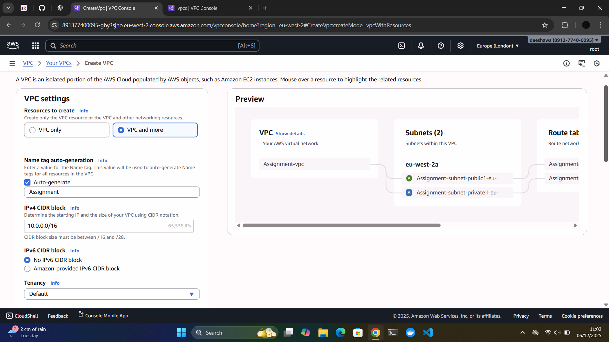
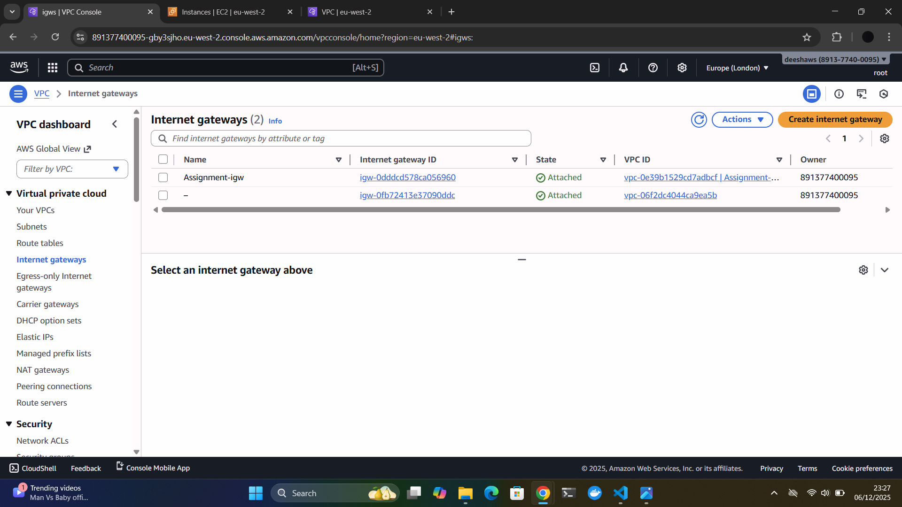
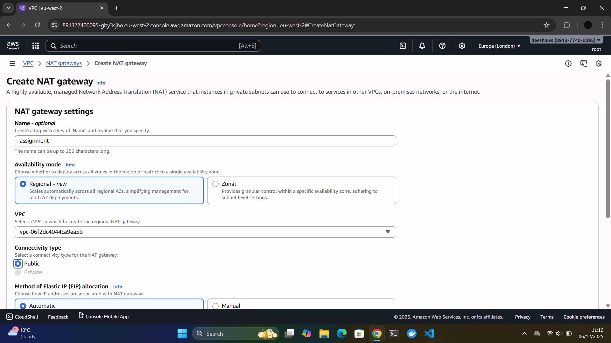
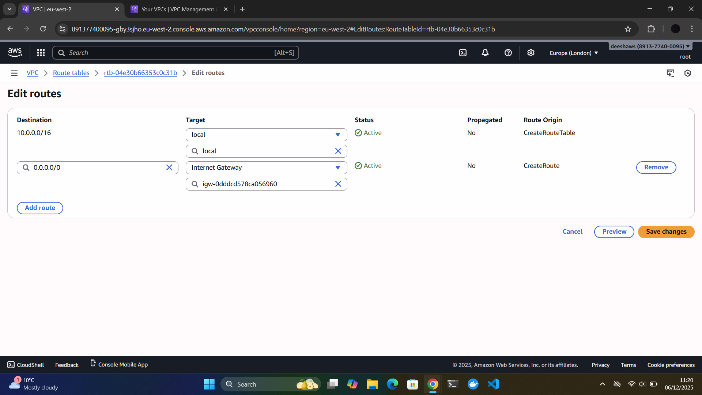
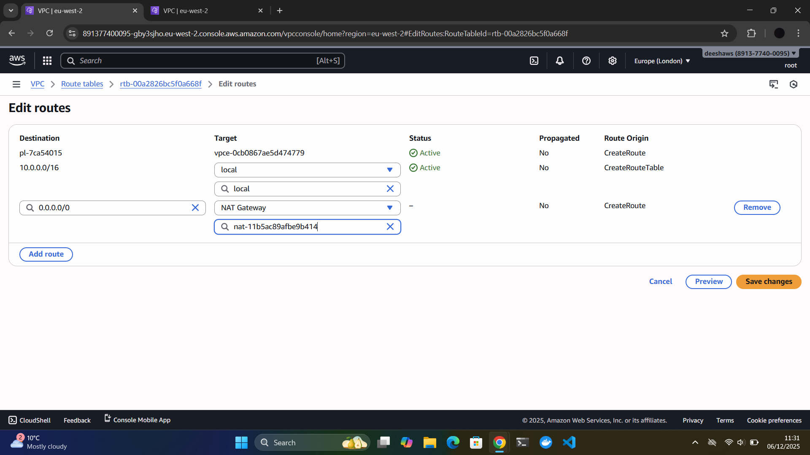
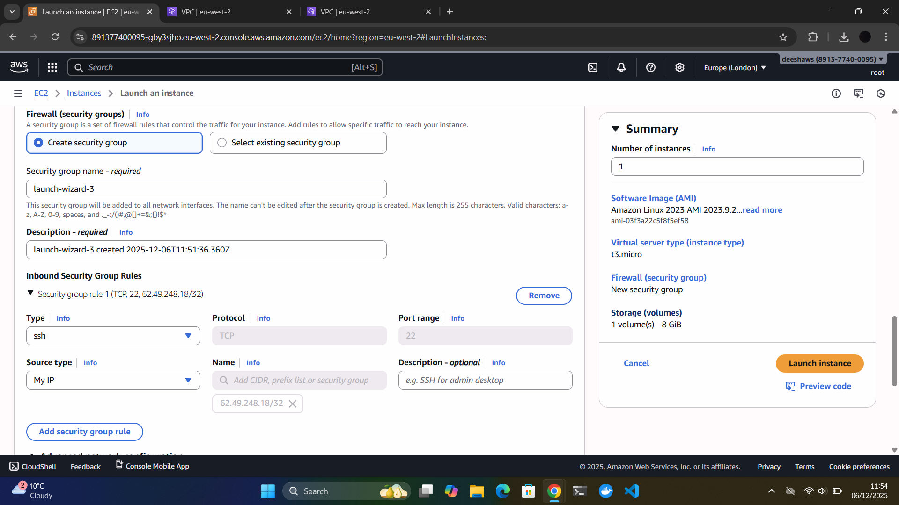
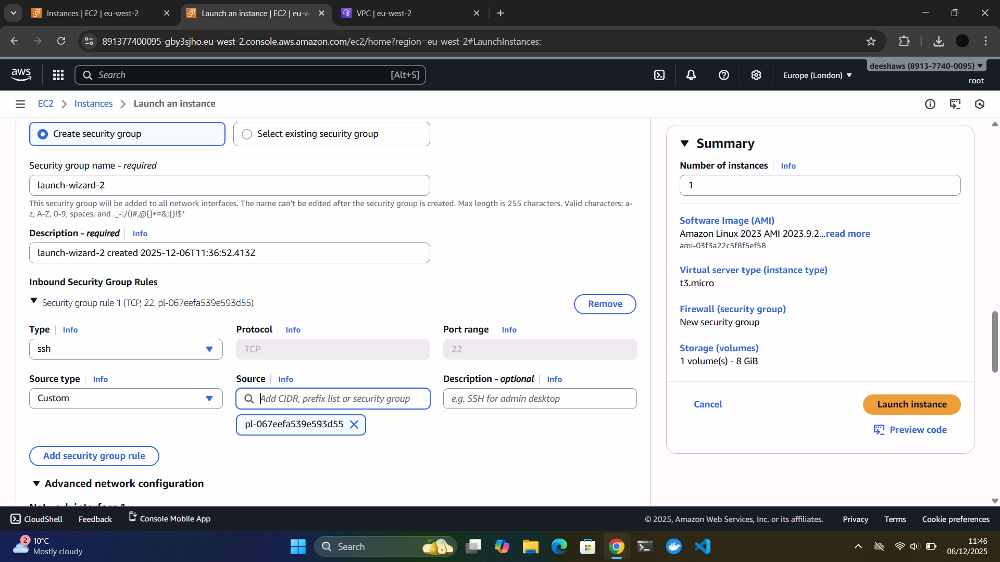

# AWS Custom VPC with Secure Public & Private Subnet with Internet and Internal EC2 Access**

---

## Assignment Objective  

Create a custom VPC with one public and one private subnet, set up correct routing for internet access, and deploy a public and private EC2 instances across them.

---

## 1️⃣ Create the VPC

### Steps Taken

- A Custom VPC was created with the CIDR block: `10.0.0.0/16`
- A Public Subnet and a Private Subnet were created inside this VPC, forming two separate network zones.

### Why this is important?

- A **VPC (Virtual Private Cloud)** allows full control of your network in the cloud including IP addressing, routing, and security. A VPC is your own private network where you can deploy and set up instances which is used in real world architectures.

- Using a `/16` CIDR provides over 65,000 internal IP addresses, which supports future scaling without redesigning the network allowing high scalability.

- A **Public Subnet** contains resources that must be reachable from the internet. For example, an EC2 instance running a web service or used for remote SSH access can be placed here so that users or administrators can connect to it directly from outside AWS. The Public Subnet is later configured to use an Internet Gateway, which enables this communication.

- A **Private Subnet** contains resources that must not be exposed to the public internet. Systems such as internal applications or sensitive backend services are protected by being placed here. These instances can still reach the internet securely for software updates, but only through controlled outbound access using a NAT Gateway, meaning no outside system can connect to them directly.
  

📸 Screenshots:

VPC set up

## 2️⃣ Task: Internet Access

- Create and attach an Internet Gateway 

- Create an Elastic IP

- Create a NAT Gateway in the public subnet.

### Steps Taken

An Internet Gateway (IGW) was created and attached to the VPC to allow communication between AWS resources in the public subnet and the wider internet.  

Next, an Elastic IP address was allocated, which provides a permanent public IP address that does not change, even if the underlying resource restarts.  

Finally, a NAT Gateway was created inside the Public Subnet and assigned the Elastic IP. This ensures that resources in the Private Subnet can access the internet securely.

### Why this is important

The Internet Gateway is essential for enabling public-facing services to communicate with external networks such as user devices, websites, and software repositories. Without the IGW, no instance can reach or be reached from the internet.

The NAT Gateway provides an important layer of protection for private instances. Private EC2 instances should not be directly exposed to the internet because doing so increases the risk of attacks. Instead, a NAT Gateway allows them to make outbound internet requests for example, to download operating system updates — without allowing any inbound traffic from unknown external sources.  

This setup reinforces secure network design by ensuring that public instances are accessible for management and testing while private instances remain isolated and protected from external threats.

📸 Screenshots:  

IGW created and attatched to VPC

Elastic IP created and assigned 

NAT Gateway created in public subnet

## 3️⃣ Task: Route Tables  

Configure route tables so that:

- The Public Route Table has a default route to the Internet Gateway (IGW)
- The Private Route Table has a default route to the NAT Gateway

### Steps Taken

Two separate route tables were configured to control traffic flow within the VPC.

The **Public Route Table** was associated with the Public Subnet, and a default route (`0.0.0.0/0`) was added that points to the Internet Gateway. This ensures that resources in the Public Subnet can send and receive traffic directly from the internet.

The **Private Route Table** was associated with the Private Subnet, and a default route (`0.0.0.0/0`) was added pointing to the NAT Gateway. This allows instances in the Private Subnet to make outbound internet connections (such as for updates), while still remaining protected from any inbound public access.

### Why this is important?

Route tables determine exactly how network traffic flows within and outside the VPC.  
By using two separate route tables:

- Public systems can be accessed from the internet when needed
- Private systems remain isolated from direct external traffic
- Outbound access from the Private Subnet is still possible without exposing it
- This creates a **secure multi-tier network**, which is the foundation of enterprise cloud architecture

This routing configuration enforces strict security boundaries while allowing functionality required for cloud workloads.

📸 Screenshots:

Public Route Table with IGW default route  

Private Route Table with NAT default route  

## 4️⃣ Tasks: EC2 Instances & Security  

- Public EC2: launch in public subnet with a public IP and Security Group must allow SSH/HTTP only from your IP  

- Private EC2: launch in private subnet without a public IP and Security Group must allow only internal access

### Steps Taken

Two EC2 instances were deployed and the security groups were set.

The **Public EC2 instance** was launched in the Public Subnet with a Public IP address assigned. This allows the instance to be accessed directly from the internet when permitted by its Security Group rules. To secure access, the Public EC2’s Security Group was configured to allow SSH only from my own public IP address. This prevents unauthorized access attempts from unknown external users.

The **Private EC2 instance** was launched in the Private Subnet with no Public IP address. This prevents the instance from being accessed directly over the internet. Its Security Group was configured to allow inbound communication only from within the VPC, specifically from the Security Group associated with the Public EC2 instance. This allows secure internal connectivity while keeping the instance fully isolated from the public internet.

### Why this is important?

Deploying instances into both a public and private subnet demonstrates how secure multi-tier architectures are built in the cloud. Systems exposed to the internet must be controlled with strict firewall rules, while internal systems must remain shielded from external threats.

📸 Screenshots:

Public EC2 security group 

Private EC2 security group

## Conclusion

In this project, a secure and scalable cloud network environment was successfully designed and deployed using AWS services. A custom VPC was created with a large CIDR range to support growth, and the network was divided into a Public Subnet and a Private Subnet to separate internet-facing resources from internal workloads.

Internet access was configured correctly using an Internet Gateway for the public subnet and a NAT Gateway for secure outbound access from the private subnet. Route tables were configured to ensure each subnet followed the correct traffic path.

Two EC2 instances were launched to demonstrate how applications operate across public and private network layers. Their access was tightly controlled using Security Groups applying the principle of least privilege  the Public EC2 only accepts SSH from a trusted administrator’s IP, while the Private EC2 remains isolated from the internet.

