# AWS Application Load Balancer with Multi-AZ EC2 Web Servers

---

## Assignment Objective  

Deploy two EC2 instances behind an **Application Load Balancer (ALB)** so that all incoming traffic is handled by the ALB. The EC2 instances must not be directly accessible from the internet, and each instance should return different content for testing load balancing.

---

## 1️⃣ Task: Two EC2 Instances

### Steps Taken

- Two EC2 instances were launched in the same **VPC**.

- Where possible, each instance was placed in a **different Availability Zone (Multi-AZ setup)** to improve resilience and availability.

- A **User Data** script was used on both instances at launch time to:
  - Install the required web server dependencies (for example, Apache or Nginx).
  - Serve a simple web page with a custom message.

- Each instance was configured to return **different content**, so that when accessed through the load balancer, it is easy to confirm that traffic is being distributed between them.

### Why this is important?

- Using **multiple Availability Zones (Multi-AZ)** increases **fault tolerance** and **high availability**. If one AZ experiences issues, the other instance in a different AZ can still serve traffic.

- Launching instances in the same VPC keeps them within a controlled, isolated network environment, which is a standard practice in real-world architectures.

- Using **User Data** to automate web server installation and configuration supports a DevOps approach, where servers are **automatically configured at launch** instead of being set up manually.

- Serving different content from each instance provides a simple but clear way to test and visually confirm that the **Application Load Balancer is correctly distributing traffic** across multiple back-end instances.

📸 Screenshots:

- EC2 instances launched in different AZs 
- User Data configuration  
- Web pages displaying different messages 

First Instance 

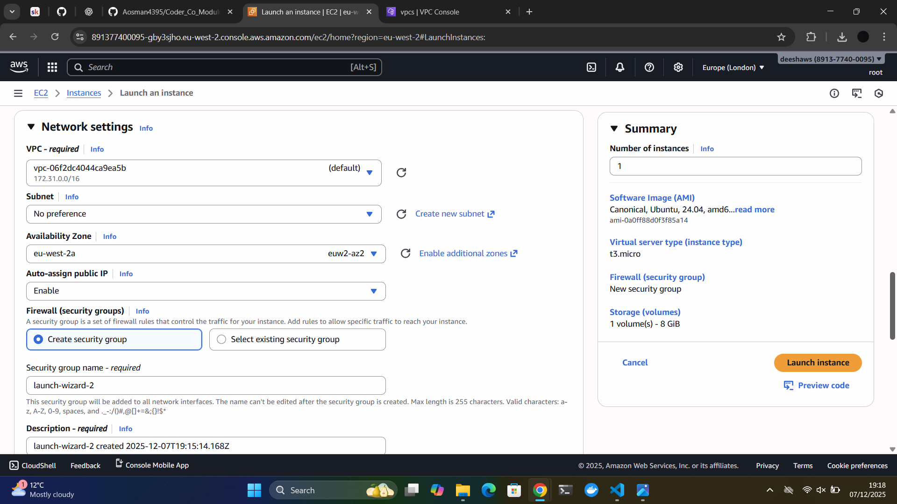
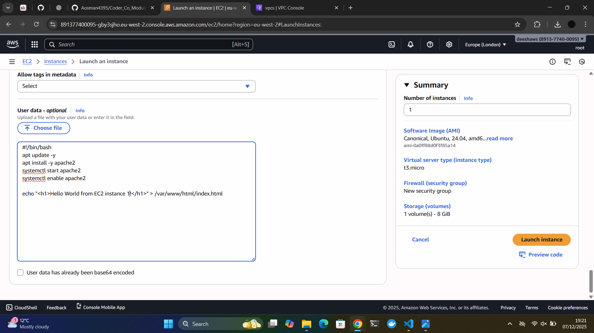
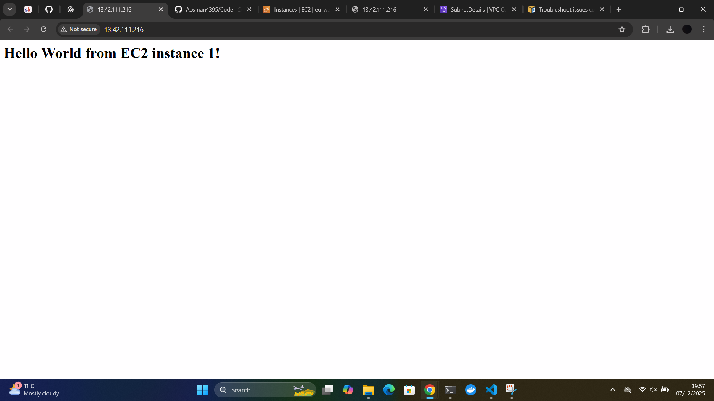

Second Instance

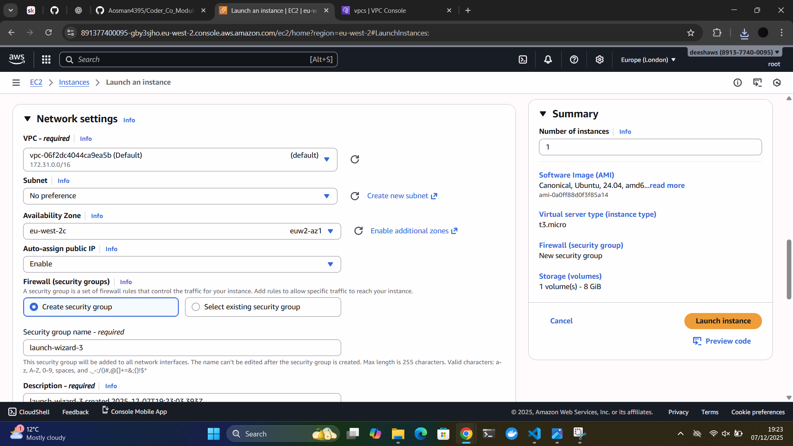
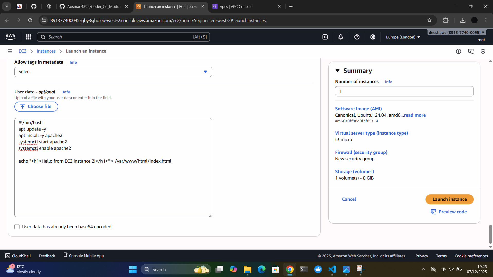
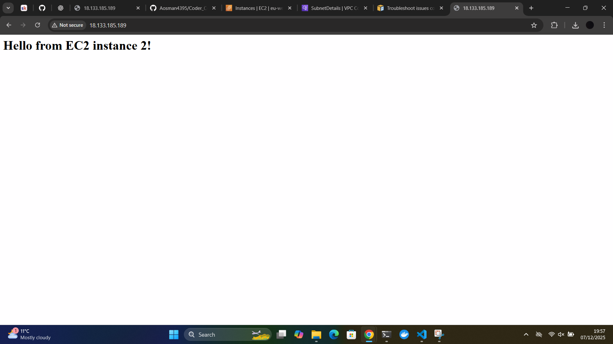

---

## 2️⃣ Task: Set Up the ALB

### Steps Taken

- An Application Load Balancer (ALB) was created and deployed across two public subnets, one in each Availability Zone. Also a HTTP listener on port 80 was added to receive incoming web traffic.  

- A Target Group was created to act as the destination for traffic routed by the ALB.

- Both EC2 instances were registered into the Target Group to allow the ALB to distribute requests between them.  

- A Health Check was configured on the root path / so that the ALB can continuously verify that each instance is operating correctly.

### Why this is important?

- The Application Load Balancer ensures that incoming traffic is shared across multiple EC2 instances which improves performance and reduces the risk of downtime.  

- Placing the ALB in two public subnets provides resilience because if one Availability Zone becomes unavailable the ALB will still operate in the other one.  

- The Target Group gives the ALB a defined backend to route traffic to which supports scalability and flexible architecture changes.  

- Health checks ensure that only healthy EC2 instances receive traffic which maintains application availability and prevents users from reaching failed servers.

📸 Screenshots:

ALB in multi-AZ setup  

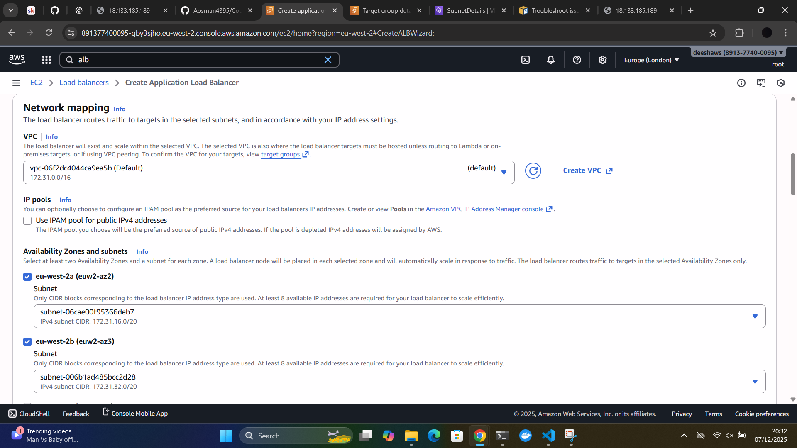

Target Group showing both registered instances  

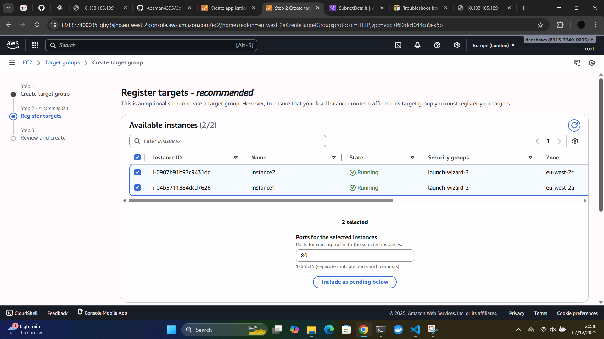

HTTP listener and health check configuration  

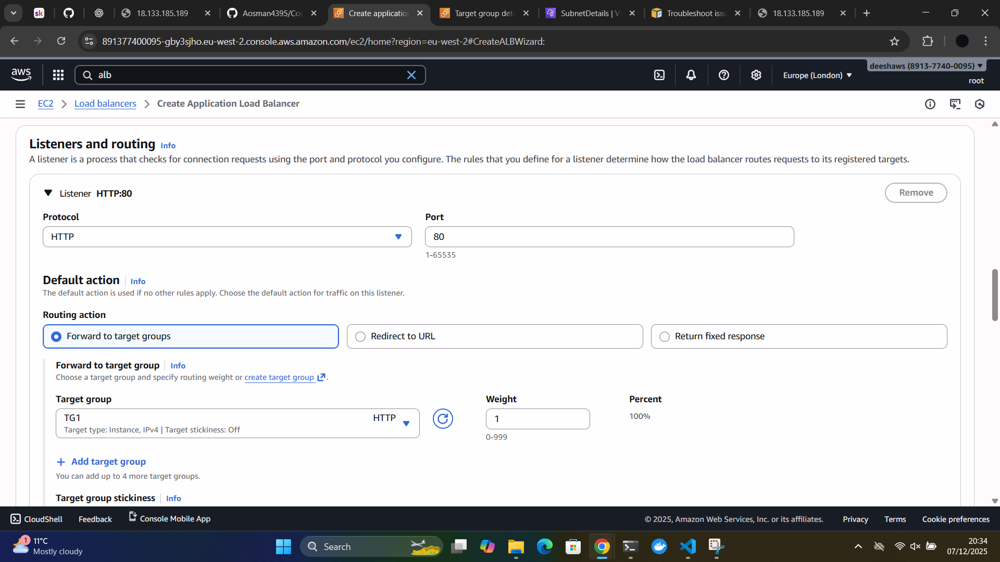

---

## 3️⃣ Task: Security Groups

### Steps Taken

- A Security Group was created for the Application Load Balancer which allows inbound HTTP traffic on port 80 from anywhere on the internet.  

- A separate Security Group was created for the EC2 instances which allows inbound HTTP traffic only from the ALB Security Group.  

- No direct public access such as SSH or HTTP from the internet was allowed to the EC2 instances.

### Why this is important?

- This setup ensures that the EC2 instances are protected and cannot be accessed directly from the public internet which greatly reduces the attack surface.  

- All incoming traffic must pass through the ALB which provides a controlled and monitored entry point into the architecture.  
By limiting access only to connections coming from the ALB Security Group the principle of least privilege is enforced ensuring only trusted traffic reaches the instances.  

This is a real world security practice that helps prevent unauthorized access network scanning attacks and exposure of backend systems.

📸 Screenshots:

ALB Security Group inbound rules  

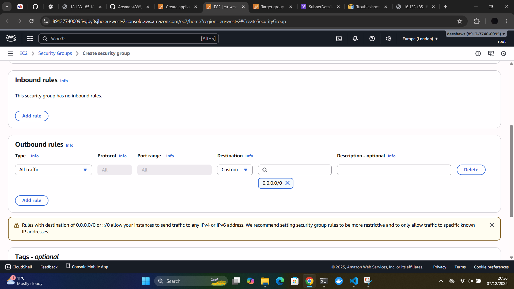

EC2 Security Group restricted to ALB traffic only  

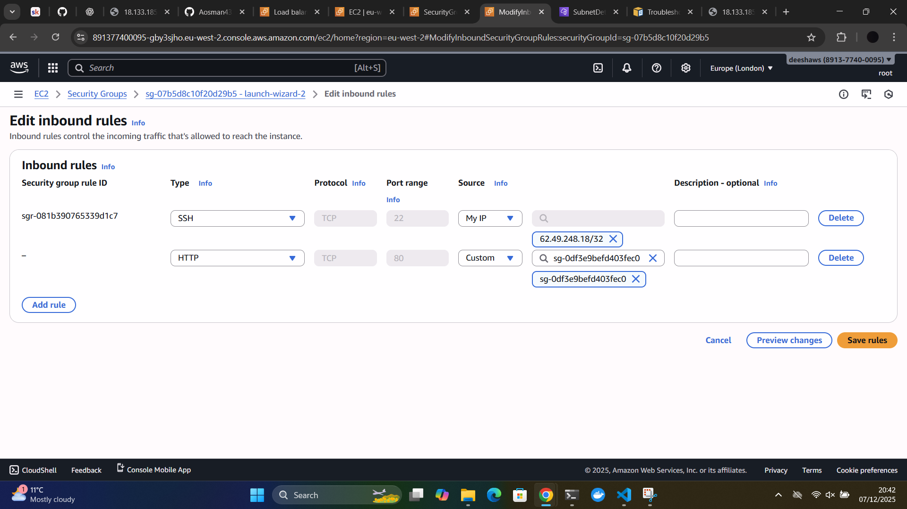

---

## 4️⃣ Task: Testing

### Steps Taken

- The DNS name of the Application Load Balancer was accessed from a web browser to verify that traffic was being routed correctly.  

- The page was refreshed multiple times to confirm that responses alternated between the two EC2 instances which shows that load balancing is working.  

- The health check status of both instances was reviewed to ensure they were marked as healthy and actively receiving traffic.

### Why this is important?

Testing is essential to confirm that the configuration is working exactly as intended. By checking the ALB DNS name and seeing different responses from each instance we can visually verify that the load balancer is correctly distributing traffic.  

Monitoring the health checks ensures that only responsive and functioning instances are serving users which improves reliability and user experience.  

This testing process validates the entire architecture and gives confidence that the deployment is resilient secure and ready for real world use.

📸 Screenshots:

Testing through ALB DNS  

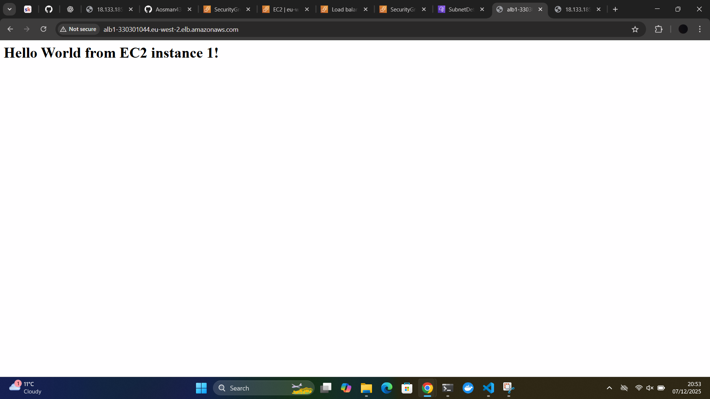

Healthy status in Target Group  

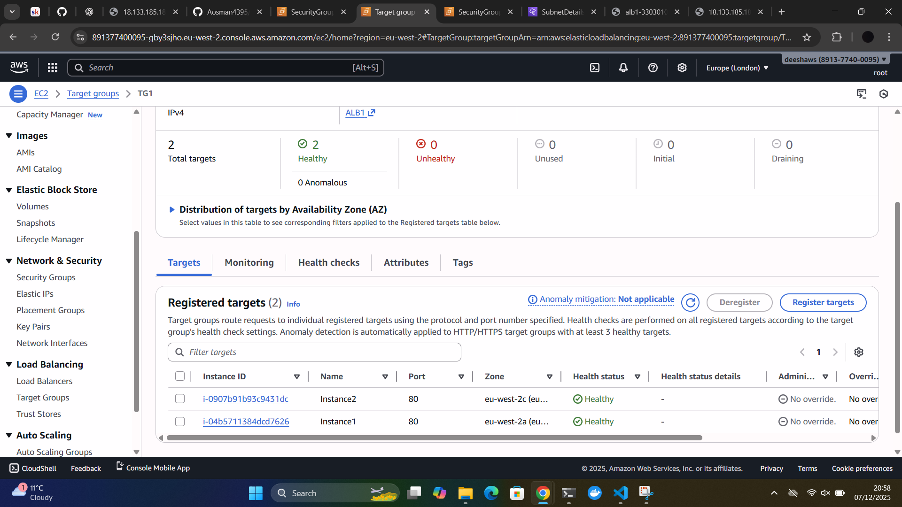

---

## Conclusion

The results shown in the Target Group and ALB configuration confirm that the entire setup was completed successfully. The Application Load Balancer is forwarding traffic through the HTTP listener on port 80 to the correct Target Group.  

Both EC2 instances are registered as targets and are reporting a **Healthy** status which means the health checks on path / are working correctly and the servers are responding successfully.  

This demonstrates that:  

- The instances are deployed correctly in a Multi AZ configuration.  
 
- The ALB is handling all incoming traffic as designed.  

- Security Groups are enforced correctly since the EC2 instances are only reachable through the ALB.  

- Load balancing is functioning and distributing traffic across both instances.  

Overall this confirms that a secure scalable and highly available architecture has been deployed following AWS best practices. The application is now resilient against failure in a single Availability Zone and the traffic flow is properly controlled and protected through the ALB.  

📸 Screenshot:

Successful ALB and Target Group configuration  

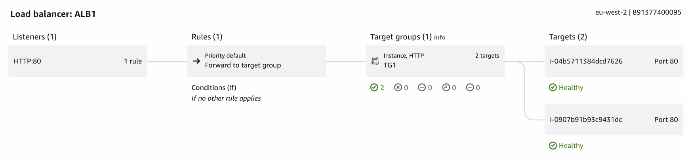

