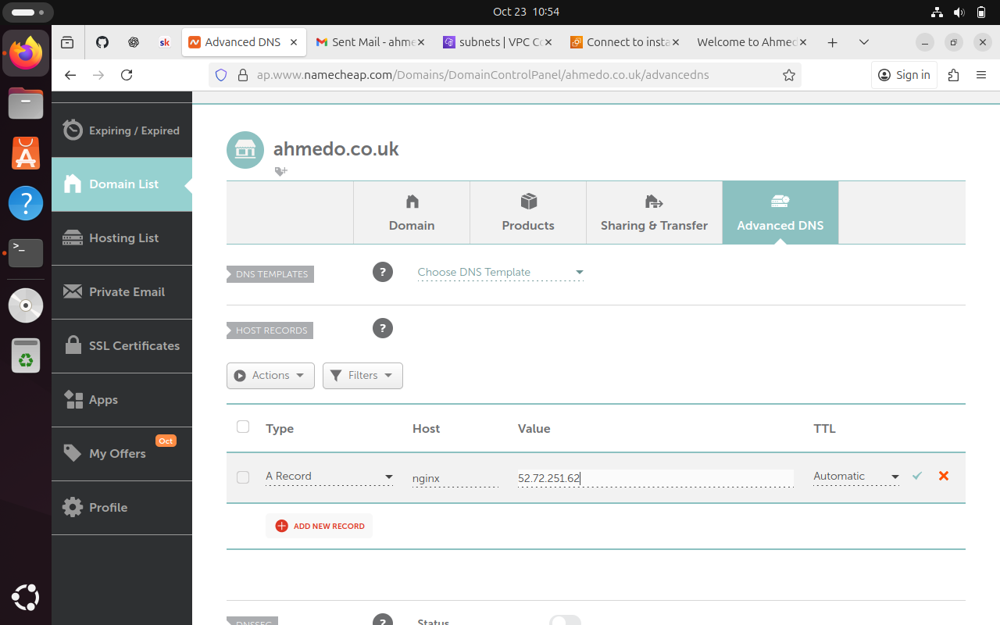

# 🖥️ Networking Assignment — AWS EC2, Nginx, and Custom Domain Setup

## 📘 Overview
This assignment demonstrates how I set up an AWS EC2 instance, installed and configured Nginx, and connected it to a custom domain purchased from Namecheap.  
The project shows my understanding of how networking, DNS, and server configurations work together to host a functional website on the cloud.

---
## ⚙️ Technologies Used
- **AWS EC2 (Ubuntu Linux)** — Virtual machine hosting the web server  
- **Nginx** — Web server software  
- **Namecheap** — Domain registrar  
- **SSH** — Secure access to the EC2 instance  
- **Windows Terminal & Ubuntu VM** — Used for connection and installation  
- **GitHub** — Documentation and version control  

---
## 🏗️ Project Steps

### 1️⃣ Set Up EC2 Instance
I started by launching an **Ubuntu EC2 instance** on AWS.  
During setup, I:
- Selected a key pair and downloaded the `.pem` file for SSH access.  
- Allowed **inbound rules** for **SSH (port 22)** and **HTTP (port 80)**.  
- Ensured **outbound rules** allowed all traffic.  

Initially, I had a problem connecting to the instance because the **Network ACL (NACL)** was blocking SSH. After editing the NACL to allow inbound and outbound SSH traffic, the connection worked.


---
### 2️⃣ Connect to the Instance Using SSH
Before connecting, I made sure I was in the same directory as my `.pem` file.  
Then I ran:

```bash
cd /path/to/pemfile
ssh -i n-assignment.pem ubuntu@<ec2-public-ip>

---

### **Section 5 — Step 3 & 4: Domain & Elastic IP**

```markdown
### 3️⃣ Purchase and Configure Domain
After confirming my instance was running, I purchased a domain from **Namecheap** — `ahmedo.co.uk`.  
I then created a subdomain called **nginx.ahmedo.co.uk** and set up the DNS configuration:  
- Type: **A Record**  
- Host: **nginx**  
- Value: **Elastic IP address** of my EC2 instance  
- TTL: **Automatic**

This linked my domain name to my EC2 instance’s IP address.



---

### 4️⃣ Allocate Elastic IP
I assigned an **Elastic IP** to my EC2 instance to ensure it kept the same public IP even if the instance restarted.  
This was necessary for the domain connection to stay consistent.


---
### 5️⃣ Install Nginx (Troubleshooting Process)
I first tried installing Nginx from my **Ubuntu VM** (running on my Windows laptop) after SSH’ing into the EC2 instance.  
Even though the network settings looked correct, the installation failed — I kept getting errors like:

> “E: Unable to locate package nginx”

I then switched to my **Windows Terminal** and SSH’d into the EC2 instance using the same key.  
From there, the commands worked perfectly, and Nginx installed successfully.

```bash
ssh -i n-assignment.pem ubuntu@<ec2-public-ip>
sudo apt update
sudo apt install nginx -y
sudo systemctl start nginx
sudo systemctl enable nginx
sudo systemctl status nginx

---

### **Section 7 — Step 6: Customize Page & Reload Nginx**

```markdown
### 6️⃣ Customize the Web Page
When I visited the domain, it initially showed the **default Nginx page**, and I couldn’t edit it because of permissions and default configuration restrictions.  
To fix this, I removed the default file and created my own **custom HTML file**.

```bash
# Remove default Nginx page
sudo rm /var/www/html/index.nginx-debian.html

# Create your custom HTML page
sudo nano /var/www/html/index.html

---

### **Section 8 — Step 7: Test Domain Connection**

```markdown
### 7️⃣ Test the Domain Connection
To confirm the connection between my domain and EC2 instance, I used the following commands:

```bash
nslookup nginx.ahmedo.co.uk
dig nginx.ahmedo.co.uk
curl nginx.ahmedo.co.uk

---

### **Section 9 — What I Learned & Repository**

```markdown
## 🧠 What I Learned
Through this assignment, I learned how to:
- Set up and connect to an **AWS EC2 instance**  
- Configure **Security Groups**, **NACLs**, and **Elastic IPs**  
- Troubleshoot SSH connection issues  
- Install and configure **Nginx** web server  
- Understand how **networking, DNS, and domains** work together  
- Configure **A records** in Namecheap to connect a domain to a server  
- Test DNS and domain connectivity using **nslookup** and **dig**  
- Replace default web content with a **custom Nginx page**

---

## 🧾 Repository
**GitHub Repository:** [Networking Assignment Repo](https://github.com/Aosman4395/Coder_Co_Modules/tree/main/Networking-Assigment)
