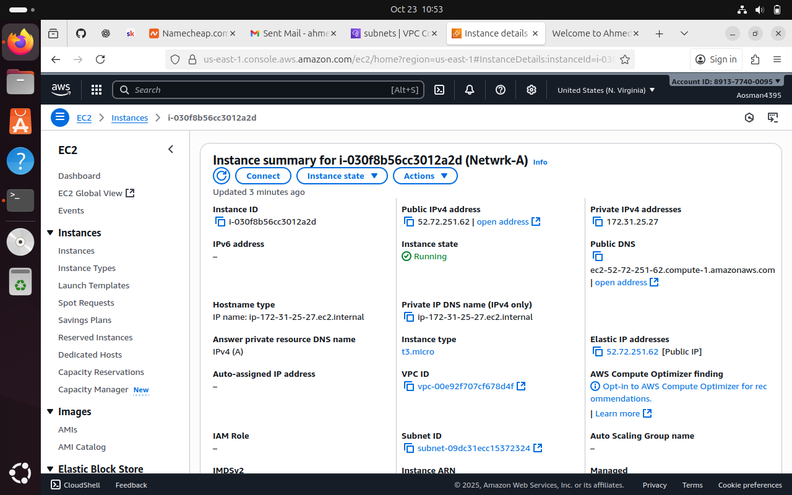
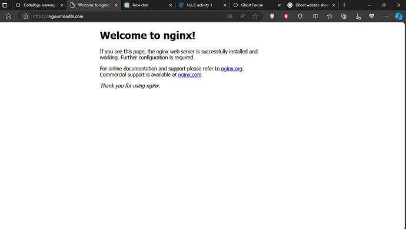

# 🧾 Assignment Brief

**Task:**  
Buy your own domain via **Cloudflare** or **AWS Route53**.  

Create an **EC2 instance** running **NGINX** on port **80**.  
Add an **A Record** to Cloudflare or Route53 and point it to your EC2 instance.  

You should be able to access the NGINX webpage using your domain — for example:  
> `nginx.luqman.co.uk`

## 📘 Introduction

This README is a **demonstration** of how I completed the networking assignment.  
It provides a **step-by-step outline** of the process I followed to successfully set up and connect my EC2 instance to a custom domain.

Initially, I attempted to use **Cloudflare** and **AWS Route53** for my domain setup, but due to configuration and access issues, they did not work as expected.  
As a result, I decided to use **Namecheap** for my DNS management, which allowed me to configure my domain records smoothly.
## 🪩 Step 1 — Setting Up the EC2 Instance

I began by setting up a new **Amazon EC2 instance**.  
From the AWS Management Console, I navigated to **EC2** and clicked **“Launch Instance.”**

I selected the following configuration:
- **Name:** Networking-Assignment  
- **AMI:** Ubuntu Server (latest version)  
- **Instance Type:** t2.micro (Free Tier eligible)  
- **Key Pair:** Created a new key pair and downloaded the `.pem` file for SSH access  

> ⚠️ Selecting a key pair is **essential**, as it allows you to securely connect to your EC2 instance later using SSH.

Once launched, my instance was up and running successfully.  
At this stage, it’s important to **take note of the Public IPv4 Address**, as it will be used to connect your EC2 instance to your custom domain.

Once your instance is up and running it should show like below and keep a note of you **Public IP address** :

## 🌐 Step 2 — Purchasing the Domain and Configuring DNS

For this step, I purchased my own domain from **Namecheap** — `ahmedo.co.uk`.  

Since the assignment required the use of **NGINX**, I created a **subdomain** with the host name `nginx`.  
This means my website would be accessible at **nginx.ahmedo.co.uk**.

In the Namecheap DNS settings:
- **Type:** A Record  
- **Host:** nginx  
- **Value:** (Public IPv4 address of my EC2 instance)  
- **TTL:** 300 seconds (5 minutes)  

This A record connects my domain to my EC2 instance, allowing anyone who visits the domain to reach the NGINX web server hosted on my instance.

## 🔐 Step 3 — Connecting to the EC2 Instance (SSH Access)

Once my EC2 instance was running, I attempted to **SSH** into it through the terminal using my `.pem` key file.  
However, I encountered a problem — the connection kept being **refused** and would not allow me to access the instance.

To troubleshoot this, I checked my **security group settings** and realised that **SSH (port 22)** traffic was not properly allowed.  
I edited the **inbound rules** to include the following:

- **Type:** SSH  
- **Protocol:** TCP  
- **Port Range:** 22  
- **Source:** My IP  

Even after updating the security group, I still could not connect.  
After further investigation, I discovered that my **Network ACL (NACL)** was also blocking SSH traffic.  
I updated the NACL rules to allow inbound and outbound connections for **port 22** as well.  

This is the inbound rules which can be found from clickng the security groups:

This is my Nacl rules allowing ssh which was not allowing me to ssh into the instance before:

Once both were updated, I successfully SSH’d into my EC2 instance using:

Before connecting, I also reviewed the EC2 Connect Page on the AWS console, which provides detailed SSH instructions.
It’s important to follow this page carefully to ensure your connection works properly.

⚠️  Make sure to give your .pem file the correct permissions before connecting, make sure you are in the same directory as where your pem file is saved and the follow the instructions:

>`chmod 400 n-assignment.pem`

>`ssh -i n-assignment.pem ubuntu@<public-ip-address>`

This is the page you should see and following the instructions gave me access:

This is the results i got indicating i was connected:

## 🖥️ Step 4 — Installing NGINX on the EC2 Instance

After connecting to my EC2 instance, I attempted to install **NGINX** using my **Ubuntu VM**. 

`sudo apt update`

`sudo apt install nginx -y`

However, I kept encountering the error:

“E: Unable to locate package nginx”
or “file not found”

Even after running sudo apt update, the installation would not proceed.

To resolve this, I switched to Windows Terminal on my host machine and SSH’d into the EC2 instance from there:
From Windows Terminal, the installation worked successfully and i ran the following:

>`sudo apt update`

>`sudo apt install nginx -y`

>`sudo systemctl start nginx`

>`sudo systemctl enable nginx`

>`sudo systemctl status nginx`

Once I confirmed that NGINX was active and running, I returned to my Ubuntu VM to continue working on the assignment and tested to see if it was active which it was:

## 🔍 Step 5 — Testing the Domain Connection

After installing NGINX and ensuring it was running, I needed to confirm that my domain was correctly pointing to my EC2 instance.  
I performed a **DNS lookup** using the following commands:

>`nslookup nginx.ahmedo.co.uk`

>`dig nginx.ahmedo.co.uk`

>`curl nginx.ahmedo.co.uk`

This result below indicated to me that my domain was active:

## 🌐 Step 6 — Accessing the NGINX Page via Domain

Once the DNS was configured, I opened a web browser and searched for my domain:

> `nginx.ahmedo.co.uk`

The page loaded successfully, confirming that my domain was correctly pointing to the EC2 instance.  
At this stage, the website displayed the **default NGINX page**, which indicated that NGINX was running properly, but I still needed to replace it with my **custom page**.

## 🎨 Step 7 — Creating a Custom Page

After confirming that the default NGINX page was loading, I replaced it with my **custom HTML page** to reflect the assignment work.

First, I removed the default NGINX page:

>`sudo rm /var/www/html/index.nginx-debian.html`

Then, I created my custom page at `/var/www/html/index.html` with the following content displayed on the website:

## 🧠 What I Learned

Completing this assignment gave me practical experience in deploying and managing cloud infrastructure.  

I learned how to **set up an AWS EC2 instance**, select an appropriate AMI, and configure a key pair to securely connect via SSH. I also gained hands-on experience with **security groups and network ACLs**, ensuring both SSH and HTTP traffic could reach the instance safely.  

Through installing NGINX, I learned how to manage web server software on a cloud instance and troubleshoot installation issues when initial attempts failed. Configuring a custom domain via Namecheap taught me how **DNS records and public IPs work together** to make a website accessible globally.  

Finally, creating a custom web page and replacing the default NGINX page reinforced my understanding of web server deployment, file management on a Linux server, and connecting a live webpage to a domain. Testing connectivity with tools like `nslookup`, `dig`, and `curl` solidified my grasp of networking fundamentals in practice.

