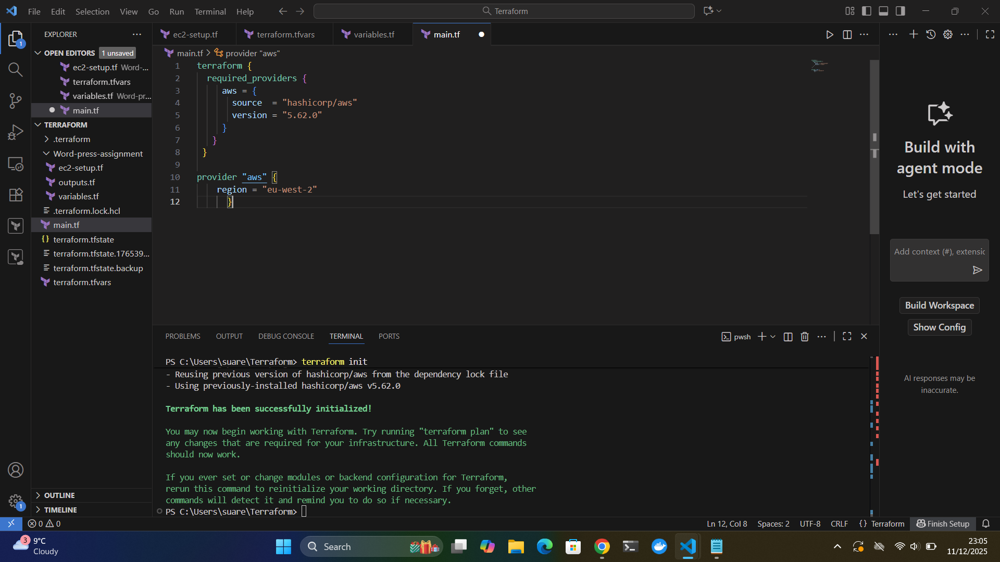
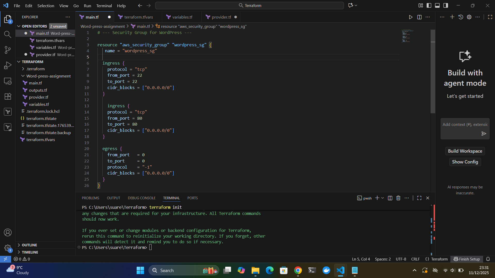
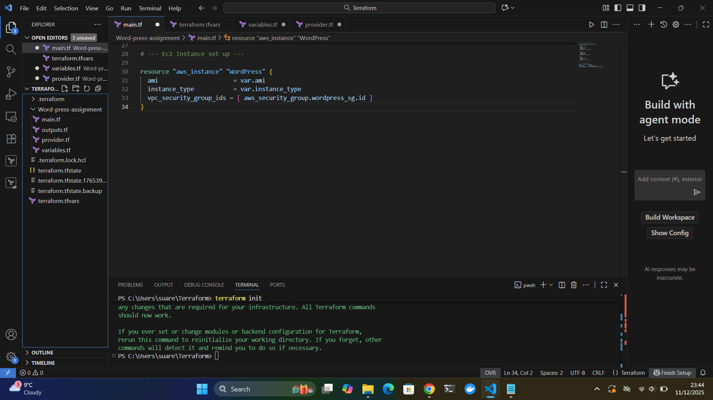
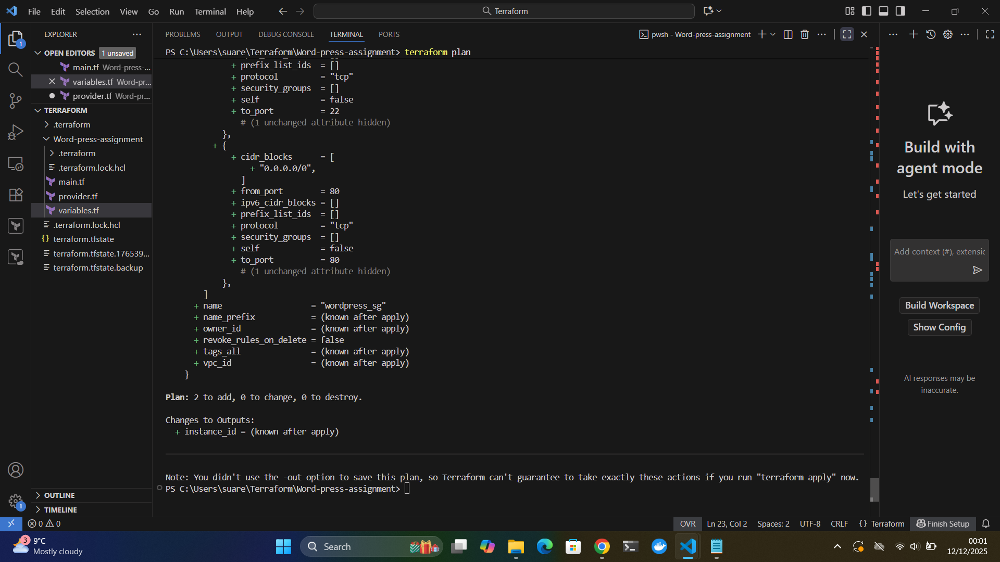
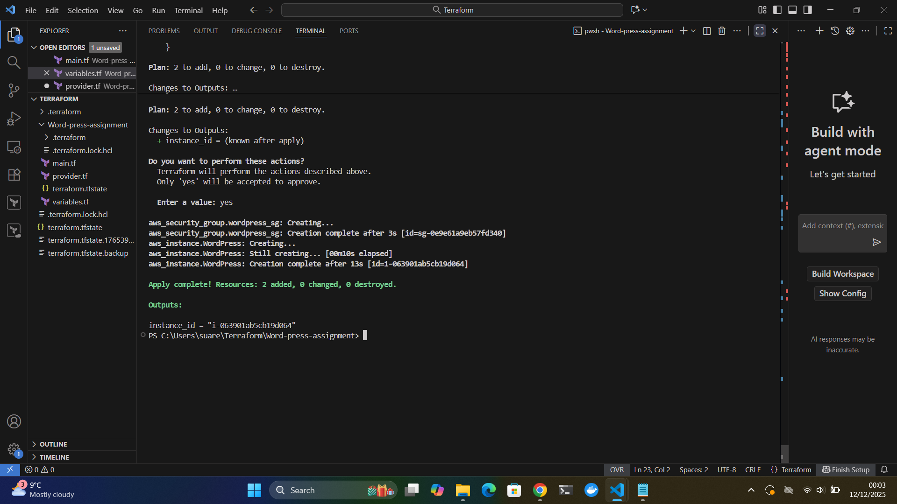
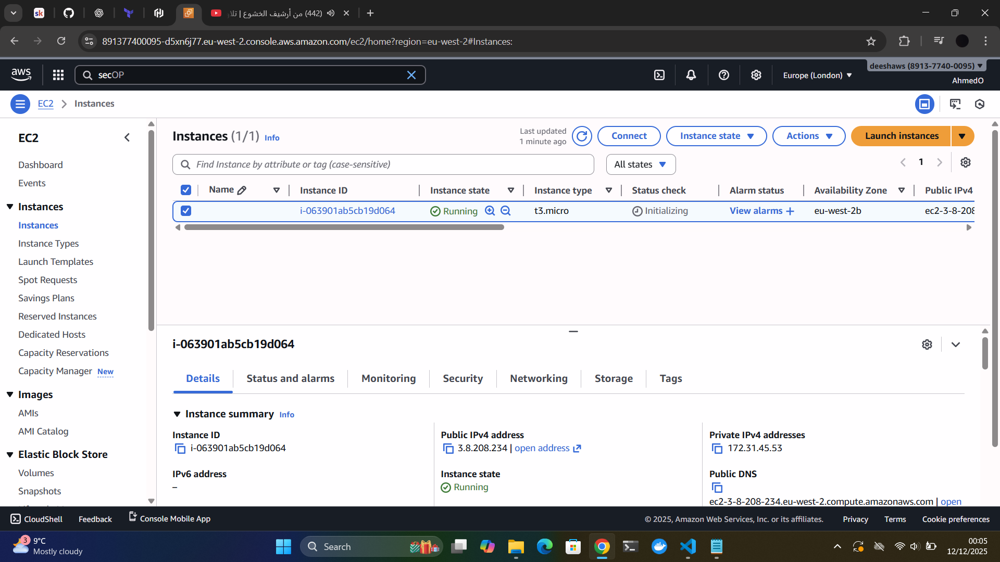

# Deploying WordPress on AWS Using Terraform

This project demonstrates how I deployed a fully working WordPress website on Amazon Web Services (AWS) using Terraform.  

The deployment includes an EC2 instance, a security group, and an automated WordPress installation using a user data script.

Each step of the deployment process is documented with screenshots to clearly show how the infrastructure was created and validated.

## 1️⃣ Step 1 – Configure Terraform Provider

The first step was to configure the AWS provider in Terraform.  

The provider tells Terraform **which cloud platform to interact with** and ensures Terraform knows how to create and manage resources on that platform.

Without defining a provider, Terraform has no way of knowing which APIs to use or where to deploy infrastructure.

In this case, I configured the provider to use **AWS in the eu-west-2 (London)** region and initialized the working directory using `terraform init`.

📸 **Screenshot:** 

This screenshot shows the provider block and the successful initialization of Terraform.

# **2️⃣ Step 2 — Create a Security Group**

Next, I created a Security Group to control what traffic can reach the EC2 instance. 

A security group acts as a virtual firewall in AWS, so configuring it correctly is essential for both access and security.

For this project, I added:

### 🔸 **Inbound Rules**

- **Port 22 (SSH):** Allows secure remote access to the instance.
- **Port 80 (HTTP):** Allows users to access the WordPress website in their browser.

### 🔸 **Outbound Rules**

- **Allow all traffic:** Ensures the EC2 instance can download packages during the WordPress installation process.

📸 **Screenshot:**  

This screenshot shows the full security group configuration with inbound and outbound rules.

# **3️⃣ Step 3 — Create an EC2 Instance**

After configuring the security group, I created the EC2 instance that will host the WordPress installation.

In this step, I specified:

### 🔸 **AMI (Amazon Machine Image)**
This defines the operating system for the EC2 instance.  
I used an Amazon Linux 2 AMI, which is compatible with the user data setup script.

### 🔸 **Instance Type**
I used a lightweight instance type (`t3.micro`) suitable for testing and WordPress setup.

### 🔸 **Security Group Attachment**
The EC2 instance was linked to the security group created in Step 2, allowing inbound SSH and HTTP traffic.

### 🔸 **Key Pair (Optional)**
A key pair can be added for SSH access, but it is not strictly required for the assignment.

📸 **Screenshot:**  
This screenshot shows the EC2 instance resource configuration in Terraform.

# **3️⃣.1 Step 3.1 — Use of Variables and Output**

To make the Terraform configuration more reusable and easier to maintain, I created variables for the AMI ID and the EC2 instance type.  

Using variables prevents hard-coding values in the configuration and allows quick updates without editing the main Terraform files.

### 🔸 **Why using variables is good practice**

- It keeps the code clean and organized and sticks to the dry code principle
- Makes the configuration reusable for future deployments  
- Allows different environments (dev, test, prod) to use different values  
- Reduces mistakes when updating values manually  

In addition to using variables, I also created an output that displays the **EC2 instance ID** after the deployment.  

This output helps verify that the instance was created successfully and provides a useful reference when checking AWS resources.

### 🔸 **Why an instance ID output is useful**

- Confirms the EC2 instance was created correctly  
- Makes it easier to locate the instance in the AWS console  
- Helps with debugging or tracking resources  
- Shows that Terraform managed the resource as expected  

📸 **Screenshot:**  
This screenshot shows the variables file and the output that returns the instance ID.

# **4️⃣ Step 4 — Add User Data**

To automate the setup of the WordPress environment, I added a user data script to the EC2 instance configuration.

User data allows commands to run automatically when the instance first boots, meaning no manual installation is required.

The user data script performs the following actions:

### 🔸 Installs Apache (web server)
### 🔸 Installs PHP and required WordPress modules
### 🔸 Downloads the latest version of WordPress
### 🔸 Extracts the WordPress files into the web server directory
### 🔸 Sets the correct file permissions
### 🔸 Restarts Apache to activate the WordPress site

This automation ensures that as soon as the EC2 instance finishes launching, WordPress is ready to access via the browser.

📸 **Screenshot:**  
This screenshot shows the user data script embedded inside the EC2 configuration.

# **5️⃣ Step 5 — Run Terraform Commands**

Once the Terraform configuration was complete, I ran the commands needed to preview and deploy the infrastructure.

---

## 🔹 **terraform plan**

I ran `terraform plan` to preview all changes before applying them.

The plan showed:

- **2 resources to add**  
  - 1 EC2 instance  
  - 1 Security Group  

Seeing exactly **2 changes** confirmed that my configuration was correct and that Terraform understood exactly what I intended to deploy.

📸 **Screenshot:**  

This screenshot shows the `terraform plan` output with 2 resources to be created.

---

## 🔹 **terraform apply**

After confirming the plan was correct, I ran `terraform apply` to deploy the infrastructure.

Terraform created:

- The Security Group  
- The EC2 instance  
- Ran the user data script to install WordPress automatically

📸 **Screenshot:**  

This screenshot shows the successful `terraform apply` output.

# **6️⃣ Step 6 — Confirm Resources in the AWS Console**

Before accessing WordPress, I logged into the AWS Management Console to confirm that the resources created by Terraform were deployed successfully.

### 🔸 **EC2 Instance**

I checked the EC2 dashboard to verify that:
- The instance was in the **Running** state
- It had a **public IPv4 address**
- It matched the AMI and instance type defined in Terraform

### 🔸 **Security Group**

I also verified that the security group had the correct inbound rules:
- Port **22** for SSH
- Port **80** for HTTP

This confirmed that Terraform had correctly created and configured all required resources.

📸 **Screenshot — EC2 Instance:**  

Shows the running instance with its public IP.

📸 **Screenshot — Security Group:**  

Shows the inbound and outbound rules.

# **7️⃣ Step 7 — Verify WordPress Works**

After confirming that the EC2 instance and security group were created successfully, I opened the instance’s **public IP address** in a web browser to test the deployment.

Using the URL of the public IP of the instance

The browser successfully loaded the **WordPress setup page**, confirming that:

- Apache was installed and running  
- PHP and all required modules were installed  
- WordPress was downloaded and extracted correctly  
- The user data script executed without errors  
- Port 80 was open and accessible  
- The EC2 instance was serving the WordPress files properly  

This validated that the Terraform automation worked end-to-end and the WordPress environment was fully functional.

📸 **Screenshot:**  

This screenshot shows the WordPress installation page loading in the browser.

# **✔️ Conclusion**

Through this project, I learned how to deploy real cloud infrastructure using Terraform and automate a full WordPress installation on AWS.  
By breaking the process into clear steps, I gained practical experience with:

- Writing Terraform configurations to manage AWS resources  
- Using variables and outputs to make the setup modular and reusable  
- Creating and applying security groups to control network access  
- Automatically configuring an EC2 instance with a user data script  
- Validating infrastructure both through Terraform and the AWS Console  
- Deploying a functioning WordPress site accessible via the public internet  

This assignment demonstrated the power of Infrastructure as Code (IaC) and showed how Terraform can reliably provision, configure, and manage cloud environments in an automated and repeatable way.
